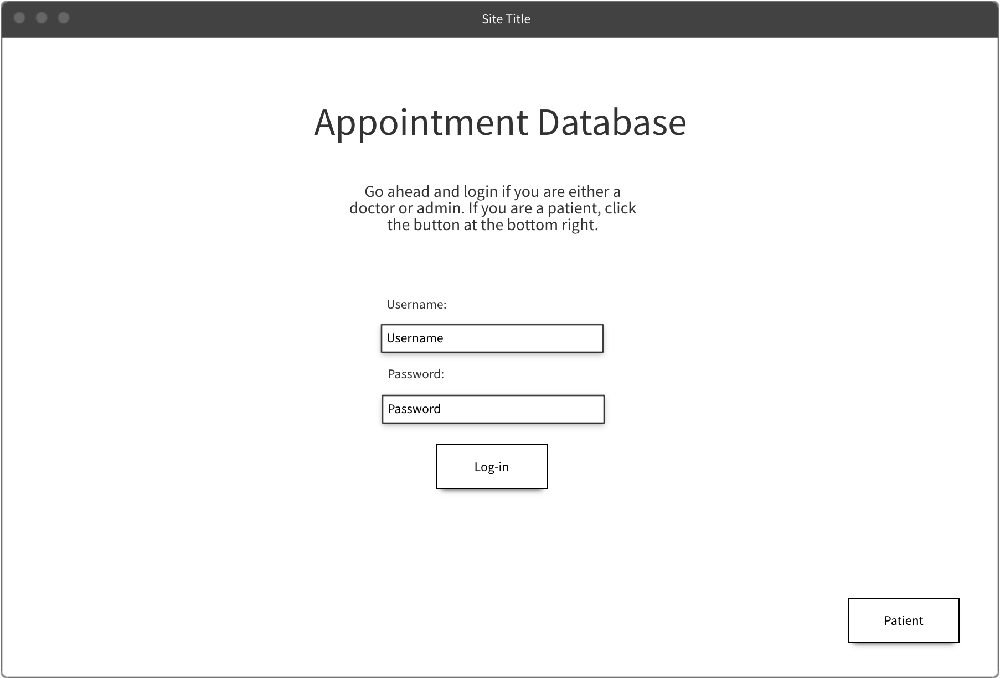
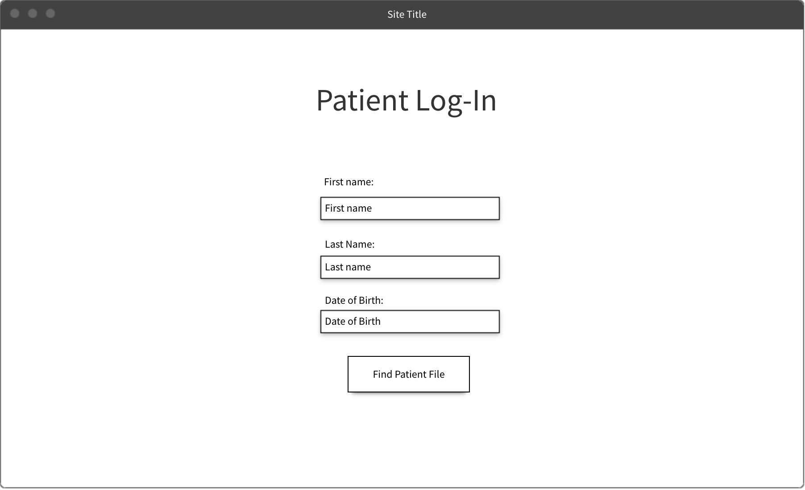
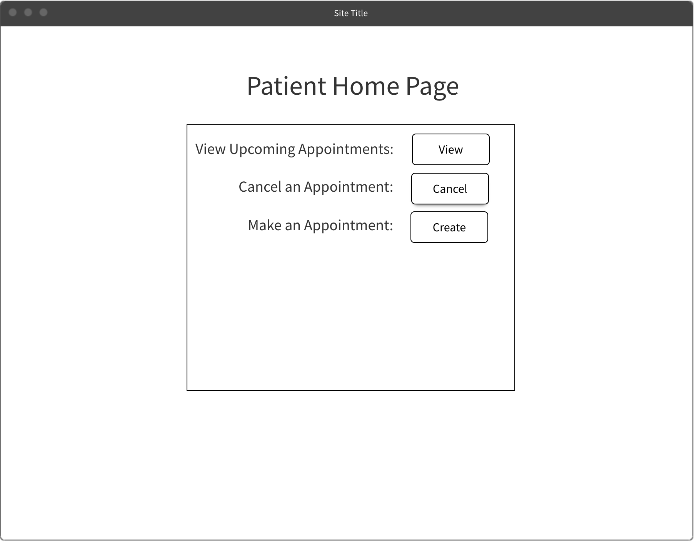
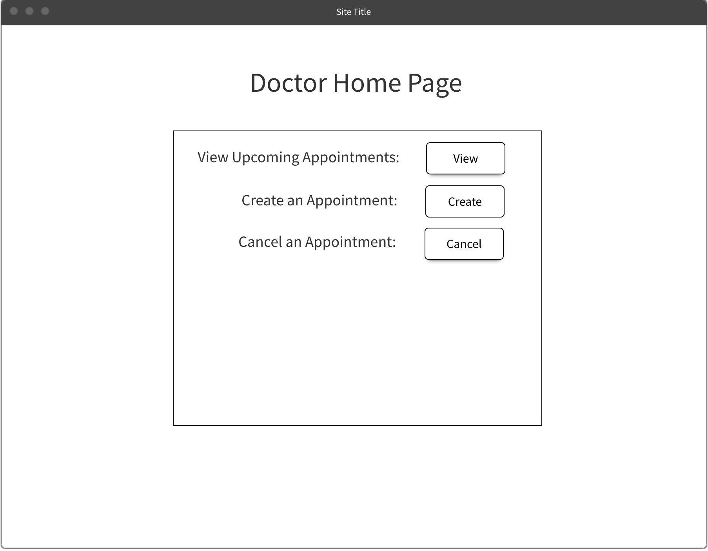
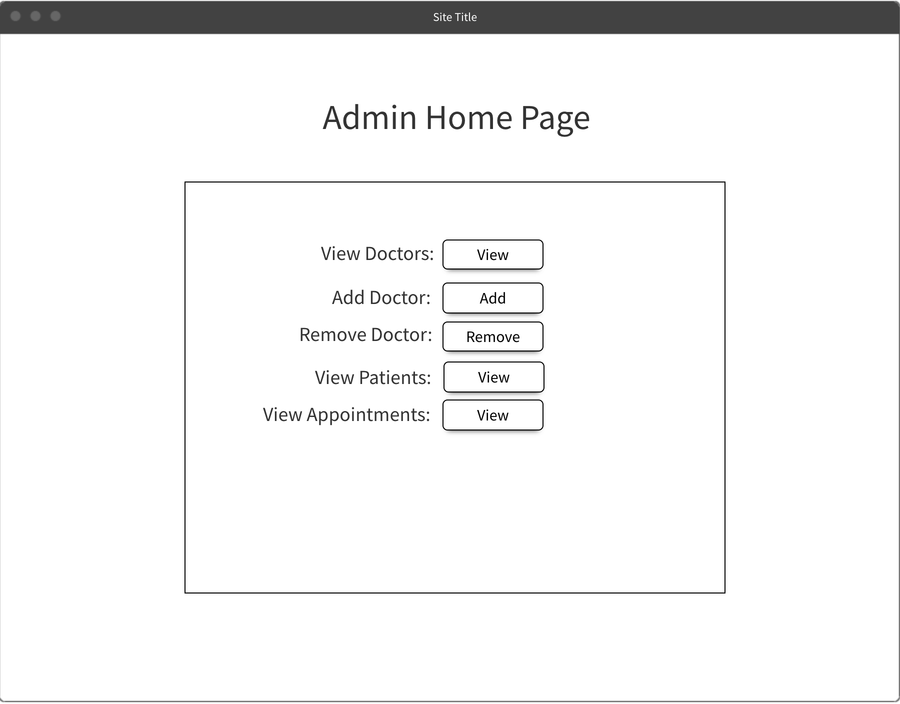
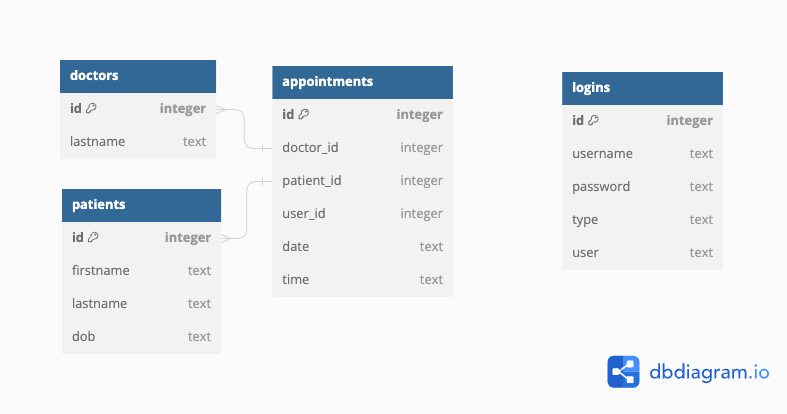

# Hospital-Full-Stack-Project

## Description

- Full-stack Flask/React application where doctors, patients, and administrators can log in and manage appointments.

---

## User Stories

As a user I want to:

- be able to access the application as either a patient, doctor, or admin so that only certain things are accessible based on my role.
- be able to log in using a username and password if I choose the role of a doctor or admin.
- if my role is admin, be able to add or remove doctors to the database.
- if my role is admin, have access to all of the doctors, as well as their patients' appointments.
- if my role is doctor, be able to view all of my patients' appointments.
- if my role is doctor, be able to add, update or remove appointments from the list.
- if my role is patient, be able to view my upcoming appointments.
- if my role is patient, be able to add, update, or cancel an appointment with my doctor.

## Front-End Wireframes

- Home/Login Page

- Patient Login Page

- Patient Home Page

- Doctor Home Page

- Admin Home Page

## Back-End Database Diagram

## License

MIT License

Copyright (c) [2023] [Juan Barajas and Wes Peters]

Permission is hereby granted, free of charge, to any person obtaining a copy
of this software and associated documentation files (the "Software"), to deal
in the Software without restriction, including without limitation the rights
to use, copy, modify, merge, publish, distribute, sublicense, and/or sell
copies of the Software, and to permit persons to whom the Software is
furnished to do so, subject to the following conditions:

The above copyright notice and this permission notice shall be included in all
copies or substantial portions of the Software.

THE SOFTWARE IS PROVIDED "AS IS", WITHOUT WARRANTY OF ANY KIND, EXPRESS OR
IMPLIED, INCLUDING BUT NOT LIMITED TO THE WARRANTIES OF MERCHANTABILITY,
FITNESS FOR A PARTICULAR PURPOSE AND NONINFRINGEMENT. IN NO EVENT SHALL THE
AUTHORS OR COPYRIGHT HOLDERS BE LIABLE FOR ANY CLAIM, DAMAGES OR OTHER
LIABILITY, WHETHER IN AN ACTION OF CONTRACT, TORT OR OTHERWISE, ARISING FROM,
OUT OF OR IN CONNECTION WITH THE SOFTWARE OR THE USE OR OTHER DEALINGS IN THE
SOFTWARE.